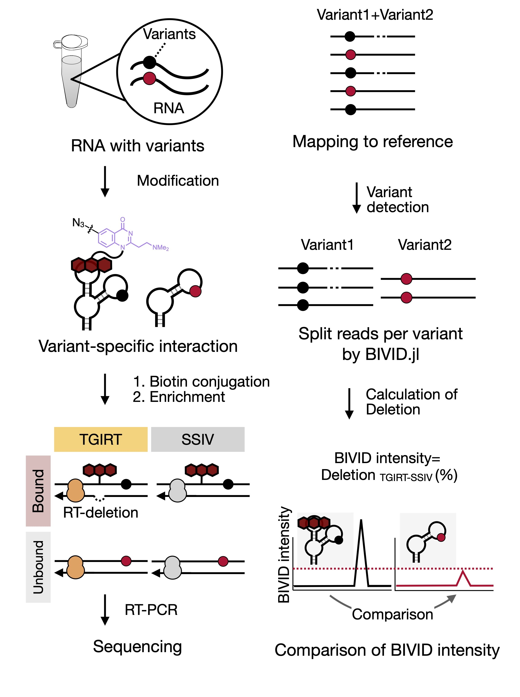

# BIVID_MaP2025

The software for distribution of sequencing reads in SAM file and calculating deletion rate for each variant.

# Installation 
```bash
git clone https://github.com/EmiMiyashita-126/BIVID_MaP2025/
```

# Content

# Requirement

・Julia (ver. 1.7.1)

# Usage
## Input

Prepare two  following arguments: <br>
  `--fasta_path` : Path of the FASTA file containing the reference and mutation sequences<br>
  `--sam_dir` : Path to directory containing SAM files mapped to the reference<br>


## Output
The common gene name for all variants is <Gene> and the argument SAM file name is <Parent>, the sequence name of each variant in FASTA file is <FASTA ID>. 
### SAM file

- `<Gene>.<Parent>.sam`  
  SAM containing all reads mapped to the target gene<br>

- `<Gene>.<Parent>.<FASTA ID>.divided.sam`  
  SAM files divided by variant

- `<Gene>.<Parent>.all_deletion.sam`  
  SAM containing reads with all deletions mapped to the target gene 

- `<Gene>.<Parent>.variantpos_deletion.sam`  
   SAM file containing reads mapped to the target gene with the deletion at the mutation position

### CSV file

- `<Gene>.<Parent>.<FASTA ID>.csv`  
  Base call table used to calculate the deletion rate for each base. Output from `<Gene>.<Parent>.<FASTA ID>.divided.sam` for each variant. 

## File Instructions
・The input FASTA file contains sequence names and their corresponding DNA sequences; the reference sequence is labelled 	`<Gene name>_Ref`.
```text
#./Demo/Input_file/test_FASTA_G4I8.txt
>G4I8_Ref
GAGATGTCTGGCGCAGACATCTCAAATTCAGCGCTTTGGTGGTGGAATGGTGCTATGTGGGCTGAAAAACAAATCGGGCTTCGGTCCGGTTC
>G4I8_Mut
GAGATGTCTGGCGCAGACATCTCAAATTCAGCGCTTTGGTGGTGGAATGATGCTATGTGGGCTGAAAAACAAATCGGGCTTCGGTCCGGTTC
```

# Demo
Executed by MacbookAir M3 8GB
```text
cd BIVID_MaP2025
# Install Julia environment
julia --project=. -e 'using Pkg; Pkg.instantiate()'

# Build Python environment
export PYTHON="/path/to/your/python"
julia --project=. -e 'using Pkg; Pkg.build("PyCall")'

# Output divided SAM files for each variant and base call tables for calculation of deleted reads
julia ./BIVID.jl --fasta_path ./Demo/Input_file/test_FASTA_G4I8.txt --sam_dir ./Demo/Input_file/input_sam 

```


