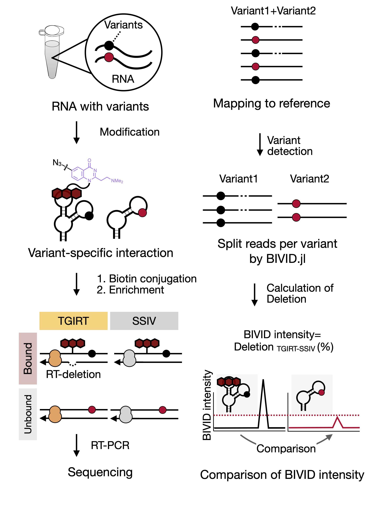

# BIVID_MaP2025

The software for distribution of sequencing reads in SAM file and calculating deletion rate for each variant.



# Installation 
```bash
git clone https://github.com/EmiMiyashita-126/BIVID_MaP2025/
```

# Content
- `BIVID.jl`: Main Julia script. Receives FASTA/SAM from command line arguments and performs the analysis.

- `Project.toml` / `Manifest.toml`:  Maintain the list of packages and versions required for this project.

- `Demo/` 
  - `Input_file/`：FASTA and SAM files for testing
    - test_FASTA_G4I8.txt
    - input_sam
      - test_TGIRT.sam
      - test_SSIV.sam
  - `Output_file/`：Various SAMs/CSVs generated after script execution
- `images/`  
  Folder with README diagrams.
# Requirement

- Julia (ver. 1.8.2)
- Python (ver. 3.8.12)

# Usage
## Input

Prepare two  following arguments: <br>
  `--fasta_path` : Path of the FASTA file containing the reference and mutation sequences<br>
  `--sam_dir` : Path to directory containing SAM files mapped to the reference<br>


## Output
The common gene name for all variants is <Gene> and the argument SAM file name is <Parent>, the sample number of each variant in FASTA file is <FASTA ID>. 
### SAM file

- `<Parent>_all_<Gene>.sam`  
  SAM containing all reads mapped to the target gene<br>

- `<Parent>_<FASTA ID>_<Gene>.sam`  
  SAM files divided by variant

- `<Parent>.all_<Gene>.deletion.sam`  
  SAM containing reads with all deletions mapped to the target gene 

- `<Parent>_unassinged_<Gene>.sam`  
   SAM file containing reads mapped to the target gene with the deletion at the mutation position
  
- `<Parent>_unassinged_<Gene>.sam`  
   SAM containing reads with all deletions in unassingned reads

- `<Parent>_all.sam`  
  SAM containing all reads mapped to the all analyzed gene
  

### CSV file
All output files will be converted to a basecall table.
Specifically, please use the following file for calculating the deletion rate per variant

- `<Parent>_<FASTA ID>_<Gene>.csv`  
  Base call table used to calculate the deletion rate for each base. Output from `<Parent>_<FASTA ID>_<Gene>.divided.sam` for each variant. 

## File Instructions
・The input FASTA file contains sequence names and their corresponding DNA sequences; the reference sequence is labelled 	`<num>_<Gene name>_Reference`.
```text
#./Demo/Input_file/test_FASTA_G4I8.txt
>1_G4I8_Reference
GAGATGTCTGGCGCAGACATCTCAAATTCAGCGCTTTGGTGGTGGAATGGTGCTATGTGGGCTGAAAAACAAATCGGGCTTCGGTCCGGTTC
>2_G4I8_Mutant
GAGATGTCTGGCGCAGACATCTCAAATTCAGCGCTTTGGTGGTGGAATGATGCTATGTGGGCTGAAAAACAAATCGGGCTTCGGTCCGGTTC
```

# Demo
Executed by MacbookAir M3 8GB
```text
cd BIVID_MaP2025
# Install Julia environment
julia --project=. -e 'using Pkg; Pkg.instantiate()'
real	0m3.659s
user	0m1.632s
sys	0m0.566s

# Build Python environment
export PYTHON="/path/to/your/python"
julia --project=. -e 'using Pkg; Pkg.build("PyCall")'
real	0m10.599s
user	0m6.958s
sys	0m1.031s

# Output divided SAM files for each variant and base call tables for calculation of deleted reads
julia ./BIVID.jl --fasta_path ./Demo/Input_file/test_FASTA_G4I8.txt --sam_dir ./Demo/Input_file/input_sam --output_dir ./Demo/Output_file/
real	0m31.185s
user	0m28.659s
sys	0m0.924s

# Ensure that there are no significant deletions in the variant positions:
# The total number of deletion‐containing reads
samtools view -c ./Demo/Output_file/test_TGIRT_all_G4I8.deletion.sam
# The number of reads with deletion in variant positions
samtools view -c ./Demo/Output_file/test_TGIRT_unassigned_G4I8.deletion.sam


